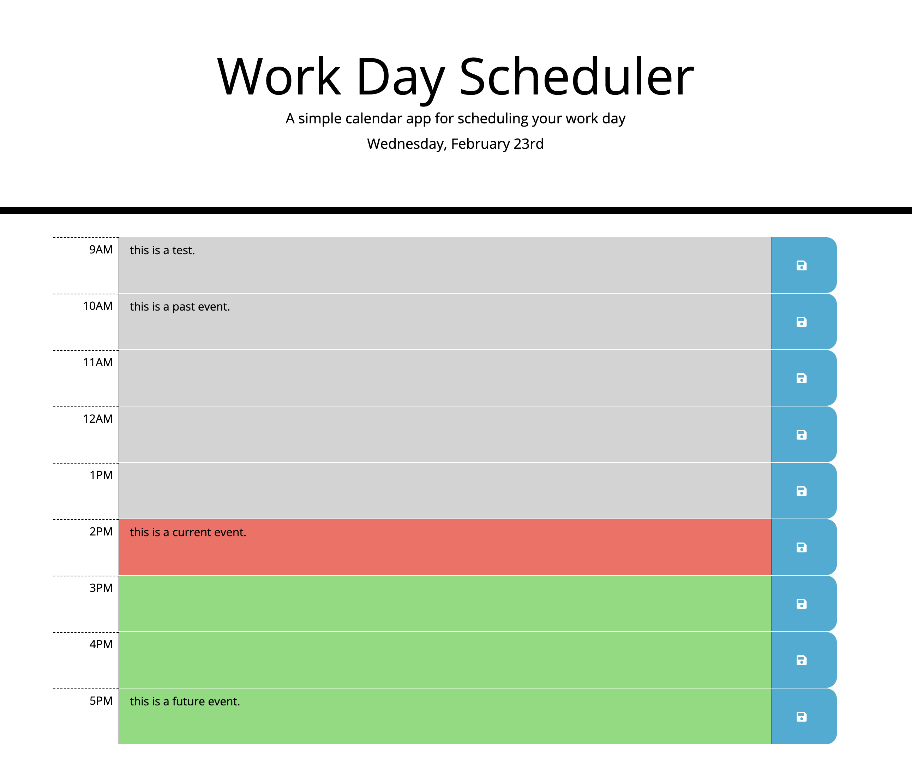

# Work Day Scheduler

## Table of contents
* [Description](#description)
* [Technologies](#technologies)
* [My Steps](#my-steps)
* [Results](#results)
* [Credit](#credit)

## Description
Create a daily planner that can manage important dates and time.
	
## Technologies
Project was updated using:
* VS Code
* HTML
* CSS
* JavaScript
* JQuery
* Moment.js
* Bootstrap
* Terminal (Mac)
* Git
* GitHub

## My Steps
### STEP 1. - SETUP
* Cloned GitHub Repository and gave it a unique name.
* Pushed first commit of files into the new Repo using Git.
* Created a live link of my site in GitHub.
* Create HTML file.

### STEP 2. - UPDATE HTML FILE WITH TIMEBLOCKS
* Used CSS file as a reference to create timeblocks in HTML.

### STEP 3. - UPDATE HTML FILE WITH BOOTSTRAP
* Added bootstrap classes to HTML.
* Added bootstrap classes for mobile responsiveness.
* Added save icon using fontawesome.

### STEP 4. - CREATE FUNCTIONALITY WITH JAVASCRIPT
* Used moment.js to add current date and time to the top of the page
* Used moment.js to get current hour.
* Get each block hour using each block's unique id.
* Run a function to compare the current hour to the block hour.
* Add and remove classes based on whether the hour is past, present, or future.
* Save each description value for each time block in local storage so event persists when page is refreshed.

### STEP 5. - FINALIZE
* Made various commits throughout process to save progress
* Tested functionality in GitHub pages

## Results

* https://github.com/etrenholm/workday-scheduler
* https://etrenholm.github.io/workday-scheduler

## Credit

Erica Trenholm: https://github.com/etrenholm

### ©️ February 2022

